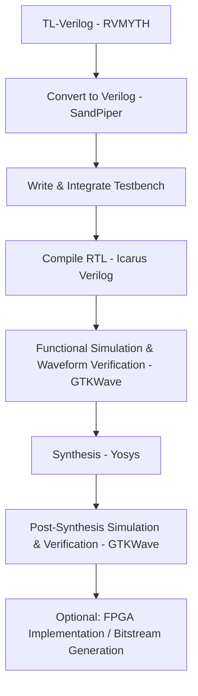

# VSDBabySoC – RISC-V SoC Simulation & Synthesis


This repository demonstrates the **functional modelling, simulation, and synthesis** of the **VSDBabySoC design**, a compact RISC-V-based System on Chip (SoC). The project integrates the **RVMYTH CPU core**, **PLL**, and **DAC**.

---

## Table of Contents

* [Introduction](#introduction)
* [Objective](#objective)
* [BabySoC Modules](#babysoc-modules)
* [Simulation Setup](#simulation-setup)
* [TLV to Verilog Conversion](#tlv-to-verilog-conversion)
* [Simulation Steps](#simulation-steps)
* [Submodule Functional Simulation](#submodule-functional-simulation)
* [Synthesis with Yosys](#synthesis-with-yosys)
* [Post-Synthesis Functional Simulation](#post-synthesis-functional-simulation)
* [RTL-to-PostSynthesis Workflow](#vsdbabysoc-rtl-to-post-synthesis-workflow)

---

## Introduction

VSDBabySoC is a compact yet highly capable **SoC based on RISC-V architecture**, designed to:

* Integrate and test multiple open-source IP cores.
* Calibrate analog components such as DAC.
* Serve as a learning platform for **SoC fundamentals** and **RTL verification**.

**Key Modules:**

* **RVMYTH:** Small RISC-V CPU core.
* **PLL:** 8x phase-locked loop for stable clock generation.
* **DAC:** 10-bit digital-to-analog converter for analog interfacing.

**Functionality Overview:**

1. **Initialization & Clock Generation:** BabySoC activates the PLL to generate a stable clock for synchronization.
2. **Data Processing:** RVMYTH processes data, updating internal registers to feed the DAC.
3. **Analog Signal Generation:** DAC converts processed digital data to analog output for external devices.

---

## Objective

* Learn **SoC fundamentals** and functional verification.
* Perform **BabySoC simulation** using **Icarus Verilog & GTKWave**.
* Synthesize the SoC for FPGA using **Yosys** and understand **gate-level mapping**.

---

## BabySoC Modules

| Module/File                       | Description                                |
| --------------------------------- | ------------------------------------------ |
| `avsddac.v`                       | DAC module for analog output               |
| `avsdpll.v`                       | PLL for clock generation                   |
| `clk_gate.v`                      | Clock gating logic                         |
| `pseudo_rand.sv`                  | Pseudo-random signal generation            |
| `pseudo_rand_gen.sv`              | Testbench helper for pseudo-random signals |
| `rvmyth.tlv`                      | RISC-V CPU core (TL-Verilog)               |
| `testbench.v`                     | Main simulation testbench                  |
| `testbench.rvmyth.post-routing.v` | Post-routing testbench                     |
| `vsdbabysoc.v`                    | Top-level SoC integration module           |

---
## Clone the BabySoC Repository

Before proceeding with simulation or synthesis, clone the official **VSDBabySoC** repository to your local system.

```bash
git clone https://github.com/manili/VSDBabySoC
cd VSDBabySoC
```

This command will create a local copy of the repository and move you into the project directory.

---

## Simulation Setup

**Tools Required:**

* **Icarus Verilog (`iverilog`)** – Compile Verilog modules.
* **GTKWave** – View `.vcd` waveform files for signal analysis.

---


## TLV to Verilog Conversion

In the **VSDBabySoC** repository, the **RVMYTH** processor core is written in **TL-Verilog (.tlv)** format.
Before running simulations, it must be **converted into a Verilog (.v)** file.
This conversion is done using the **SandPiper-SaaS** tool inside a Python virtual environment.

---

### Steps for TLV to Verilog Conversion

#### 1. Install required packages

Open your terminal and install the Python virtual environment tools:

```bash
sudo apt update
sudo apt install python3-venv python3-pip
```

---

#### 2. Create and activate a virtual environment

Navigate to the BabySoC project folder, create a new environment, and activate it:

```bash
cd ~/VLSI/VSDBabySoC/
python3 -m venv sp_env
source sp_env/bin/activate
```

Once activated, your terminal prompt will show the environment name `(sp_env)`.

---

#### 3. Install SandPiper-SaaS

With the environment active, install the required Python packages including **SandPiper-SaaS**:

```bash
pip install pyyaml click sandpiper-saas
```

---

#### 4. Convert TLV file to Verilog

Now convert the **rvmyth.tlv** file into a **Verilog (.v)** file using the command below:

```bash
sandpiper-saas -i ./src/module/*.tlv -o rvmyth.v --bestsv --noline -p verilog --outdir ./src/module/
```

After successful conversion, you’ll find a new file named `rvmyth.v` inside the `src/module` directory.

---


#### 5. Verify the generated files

You can confirm the new Verilog file was created by listing the directory contents:

```bash
cd ~/VLSI/VSDBabySoC/
ls src/module/
```

**Expected output:**

```
avsddac.v  avsdpll.v  clk_gate.v  pseudo_rand_gen.sv  pseudo_rand.sv  
rvmyth_gen.v  rvmyth.tlv  rvmyth.v  testbench.rvmyth.post-routing.v  
testbench.v  vsdbabysoc.v
```

---

### Important Notes

* Every time you open a new terminal session, activate the environment before running SandPiper:

  ```bash
  source sp_env/bin/activate
  ```

* To deactivate the environment when you’re done:

  ```bash
  deactivate
  ```

---

## Submodule Functional Simulation

Before simulating the complete SoC (`vsdbabysoc.v`), each **submodule** is functionally verified individually to ensure correct behavior.

### 1. **DAC Module (`avsddac.v`)**

The DAC (Digital-to-Analog Converter) converts the digital data output from the RVMYTH core into an analog signal.

#### **Commands Used**


```bash
# Create output directory
mkdir -p ~/Desktop/VSDBabySoC/output/avsddac

# Compile the DAC module testbench
iverilog -o ~/Desktop/VSDBabySoC/output/avsddac/avsddac.out \
  -DPRE_SYNTH_SIM \
  -I ~/Desktop/VSDBabySoC/src/include \
  -I ~/Desktop/VSDBabySoC/src/module \
  ~/Desktop/VSDBabySoC/src/module/tb_avsddac.v

# Run the simulation
vvp ~/Desktop/VSDBabySoC/output/avsddac/avsddac.out

# View the waveform
gtkwave avsddac.vcd
```


#### **Observation:**

The DAC correctly converts the input digital values into an analog-like output waveform. Reset and clock synchronization are verified successfully.

---

### 2. **PLL Module (`avsdpll.v`)**

The PLL (Phase-Locked Loop) generates a stable, higher-frequency clock for SoC synchronization.

#### **Commands Used**

```bash
mkdir -p ~/Desktop/VSDBabySoC/output/avsdpll

iverilog -o ~/Desktop/VSDBabySoC/output/avsdpll/avsdpll.out \
  -DPRE_SYNTH_SIM \
  -I ~/Desktop/VSDBabySoC/src/include \
  -I ~/Desktop/VSDBabySoC/src/module \
  ~/Desktop/VSDBabySoC/src/module/tb_avsdpll.v

vvp ~/Desktop/VSDBabySoC/output/avsdpll/avsdpll.out
gtkwave avsdpll.vcd
```

> 

#### **Observation:**

PLL multiplies the input reference clock to generate a stable, high-frequency output clock used by other SoC modules.

---

### 3. **RVMYTH CPU Core (`rvmyth.v`)**

The RVMYTH module is the heart of the SoC, implementing a simple **RISC-V processor** that executes instructions and communicates with other components.

#### **Commands Used**

```bash
mkdir -p ~/Desktop/VSDBabySoC/output/rvmyth

iverilog -o ~/Desktop/VSDBabySoC/output/rvmyth/rvmyth.out
-DPRE_SYNTH_SIM
-I ~/Desktop/VSDBabySoC/src/include
-I ~/Desktop/VSDBabySoC/src/module ~/Desktop/VSDBabySoC/src/module/clk_gate.v
~/Desktop/VSDBabySoC/src/module/rvmyth.v ~/Desktop/VSDBabySoC/src/module/tb_rvmyth.v

vvp /home/vsduser/Desktop/VSDBabySoC/output/rvmyth/rvmyth.out

gtkwave rvmyth.vcd
```


> 

#### **Observation:**

The CPU executes basic instructions and correctly drives the internal data bus. Instruction fetch, decode, and execution stages are verified from the waveform.

---

### **Summary**

| Module      | Function Verified                          | Result   |
| ----------- | ------------------------------------------ | -------- |
| `avsddac.v` | Digital to Analog conversion               |  Passed |
| `avsdpll.v` | Clock multiplication and stabilization     |  Passed |
| `rvmyth.v`  | Instruction execution and register updates |  Passed |

---


## Simulation Steps

1. **Set the directory**

```bash

cd VSDBabySoC/src/module/
```

2. **Compile Verilog modules:**

```bash
iverilog -o ../../output/babysoc_sim.out -I ../include *.v testbench.v
```

3. **Run simulation:**

```bash
./../../output/babysoc_sim.out
```

4. **Open waveform in GTKWave:**

```bash
gtkwave ../../output/babysoc_sim.vcd
```


---


## Synthesis with Yosys

### Repository Structure

```
VSDBabySoC/
├── src/
│   ├── module/
│   │   ├── vsdbabysoc.v
│   │   ├── rvmyth.v
│   │   └── clk_gate.v
│   └── include/
│       └── sp_verilog.vh
├── lib/
│   ├── avsdpll.lib
│   ├── avsddac.lib
│   └── sky130_fd_sc_hd__tt_025C_1v80.lib
└── output/
    └── synth/
```


---

### Yosys Synthesis Workflow

```
# 1. Load top module
read_verilog ./src/module/vsdbabysoc.v

# 2. Load CPU core
read_verilog -I ./src/include ./src/module/rvmyth.v

# 3. Load clock gate
read_verilog -I ./src/include ./src/module/clk_gate.v
# (comment out include "sp_verilog.vh" in clk_gate.v if missing)

```
---


---
```

# 4. Read standard cell / custom libraries
read_liberty -lib ./src/lib/avsdpll.lib
read_liberty -lib ./src/lib/avsddac.lib
read_liberty -lib ./src/lib/sky130_fd_sc_hd__tt_025C_1v80.lib
```
---

 

---

```

# 5. Check hierarchy
hierarchy -check -top vsdbabysoc

# 6. Synthesis
synth -top vsdbabysoc

```
---


---

```
# 7. Map D flip-flops
dfflibmap -liberty ./src/lib/sky130_fd_sc_hd__tt_025C_1v80.lib

# 8. Optimize
opt

# 9. Technology mapping using ABC
abc -liberty ./src/lib/sky130_fd_sc_hd__tt_025C_1v80.lib -script +strash;scorr;ifraig;retime;{D};strash;dch,-f;map,-M,1,{D}

# 10. Flatten and clean
flatten
setundef -zero
clean -purge
rename -enumerate
stat

```
---


---
```
# 11. Write synthesized Verilog
write_verilog -noattr ./output/synth/vsdbabysoc.synth.v
```

---

## Post-Synthesis Functional Simulation

After generating the synthesized netlist, it’s important to **verify functionality at the gate level**. This ensures the design still behaves correctly after synthesis.

---

### **Step 1: Copy standard cell and synthesized netlist files**

```bash
cd ~/Desktop/VSDBabySoC/src/module
cp ../gls_model/sky130_fd_sc_hd.v .
cp ../gls_model/primitives.v .
cp ../../output/post_synth_sim/vsdbabysoc.synth.v .
```

Standard cell and primitive definitions are required for simulating the synthesized design. The netlist file (`vsdbabysoc.synth.v`) contains the gate-level implementation.

---

### **Step 2: Compile the testbench with Icarus Verilog**

```bash
iverilog -o ../../output/post_synth_sim/post_synth_sim.out \
-DPOST_SYNTH_SIM -DFUNCTIONAL -DUNIT_DELAY=#1 \
-I ../include -I . \
testbench.v
```


* `-DPOST_SYNTH_SIM` defines macro for post-synthesis simulation.
* `-DFUNCTIONAL` ensures functional simulation mode.
* `-DUNIT_DELAY=#1` assigns gate delay for the simulation.
* `-I` flags include header files.

---

### **Step 3: Run the simulation**

```bash
../../output/post_synth_sim/post_synth_sim.out
```

* Executes the post-synthesis simulation, generating `.vcd` waveform output.


---

### **Step 4: View the waveforms in GTKWave**

```bash
gtkwave post_synth_sim.vcd
```


**Observation:**
The synthesized netlist matches the functional behaviour of the RTL design, confirming correctness post-synthesis.


## **VSDBabySoC RTL-to-Post-Synthesis Workflow**




---


