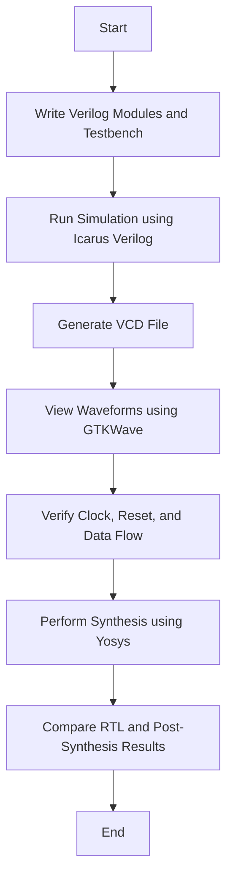

# Understanding SoC Fundamentals and BabySoC Functional Modelling

This document explains the basic concepts of a System on Chip (SoC) and how the VSDBabySoC project helps in learning SoC design through functional modelling and simulation.

---

## Table of Contents

1. [Introduction](#introduction)
2. What is a System on Chip (SoC)
3. Main Components of SoC
4. Understanding the BabySoC Design
5. Functional Modelling and Simulation Process
6. Conclusion
7. References and Resources

---

## 1. Introduction

A System on Chip (SoC) is an advanced type of integrated circuit that combines all the key parts of a computer system into a single chip. Instead of using separate chips for each function, an SoC integrates the processor, memory, input-output interfaces, and communication modules together.
This combination results in smaller, faster, and more power-efficient electronic devices.

The BabySoC project is a simplified version of a real SoC. It helps students understand how SoC components work together and how simulation tools are used to verify the design before actual hardware implementation.

---

## 2. What is a System on Chip (SoC)

A System on Chip (SoC) is a compact and complete system built on a single silicon chip. It performs all tasks required by a computing device such as processing, communication, and control.
SoCs are widely used in smartphones, IoT devices, and embedded systems because they save space, power, and cost.

The main goal of SoC design is to make the system more efficient by reducing external connections and improving the communication between internal components.

---

## 3. Main Components of SoC

| Component                     | Description                                                                               |
| ----------------------------- | ----------------------------------------------------------------------------------------- |
| CPU (Central Processing Unit) | Executes program instructions and performs calculations.                                  |
| Memory                        | Stores data temporarily (RAM) and permanently (ROM or Flash).                             |
| I/O Interfaces                | Allow the SoC to communicate with external devices such as sensors, displays, or storage. |
| Interconnects                 | Internal communication links between processor, memory, and peripherals.                  |
| Clocking Circuit (PLL)        | Maintains a stable clock signal for synchronization.                                      |
| Peripherals                   | Components like DACs, timers, or communication units that support specific tasks.         |

---

## 4. Understanding the BabySoC Design

The **VSDBabySoC** is an open-source educational SoC that demonstrates how different modules in a chip work together. It includes three key modules:

* **RVMYTH Processor:** A RISC-V based CPU core responsible for executing digital instructions.
* **PLL (Phase-Locked Loop):** Generates a stable and synchronized clock signal to drive the entire SoC.
* **DAC (Digital to Analog Converter):** Converts digital outputs from the processor into analog signals that can be sent to external devices.

The BabySoC allows learners to explore the basic functions of SoC components and understand how digital and analog modules interact inside a chip.

---

## 5. Functional Modelling and Simulation Process

Before physical manufacturing, every SoC undergoes **functional modelling**. This step ensures that the logical behavior of the system is correct.

The following tools are used for simulation and waveform analysis:

| Tool           | Purpose                                                      |
| -------------- | ------------------------------------------------------------ |
| Icarus Verilog | Used to compile and simulate Verilog code.                   |
| GTKWave        | Used to view signal waveforms from the simulation.           |
| Yosys          | Used to synthesize Verilog designs into gate-level netlists. |

### Flowchart of the Simulation Process

Through these steps, the BabySoC design can be verified for correct behavior at each stage, from high-level simulation to gate-level verification.

---

## 6. Conclusion

The BabySoC project provides an excellent starting point for understanding how SoCs work. By studying its components and simulating their behavior, learners gain insight into:

* How data flows between the processor, PLL, and DAC.
* How a functional model helps detect design issues early.
* How simulation tools assist in verifying and visualizing the internal operations of a chip.

This hands-on approach builds a strong foundation for advanced topics such as RTL design, synthesis, and physical implementation.

---

## 7. References and Resources

**GitHub Repositories**

* Fundamentals of SoC Design:
  
  [https://github.com/hemanthkumardm/SFAL-VSD-SoCJourney/tree/main/11.%20Fundamentals%20of%20SoC%20Design](https://github.com/hemanthkumardm/SFAL-VSD-SoCJourney/tree/main/11.%20Fundamentals%20of%20SoC%20Design)
* VSDBabySoC Project:
  
  [https://github.com/manili/VSDBabySoC](https://github.com/manili/VSDBabySoC)

**Video Tutorials**

* Introduction to SoC Design (Neso Academy): [https://www.youtube.com/watch?v=qtw5z9H6Rss](https://www.youtube.com/watch?v=qtw5z9H6Rss)
* RISC-V BabySoC Overview (VSDOpen)        : [https://www.youtube.com/watch?v=vvV_7iASuSg](https://www.youtube.com/watch?v=vvV_7iASuSg)
* Verilog Simulation and GTKWave Tutorial  : [https://www.youtube.com/watch?v=8h6Bf3UL6aA](https://www.youtube.com/watch?v=8h6Bf3UL6aA)

---

